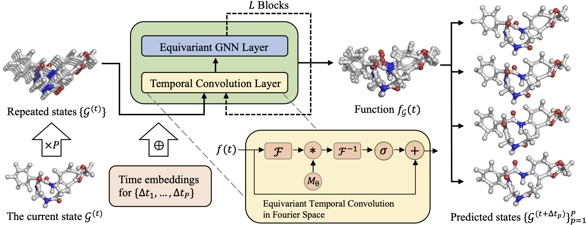
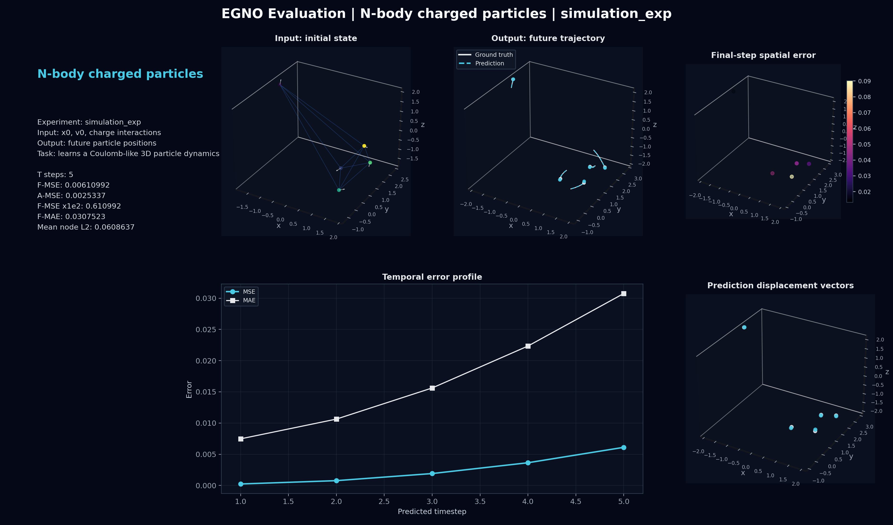
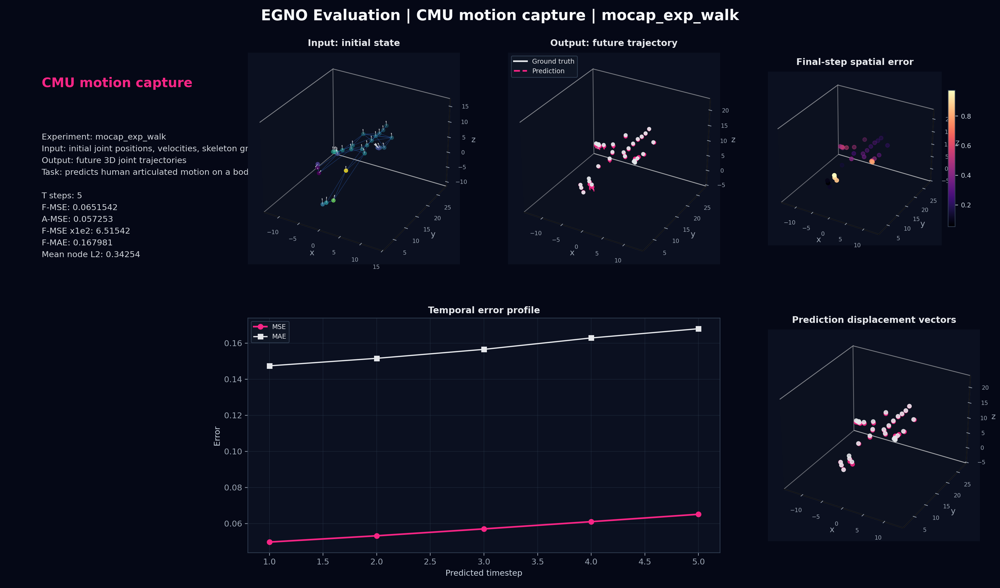
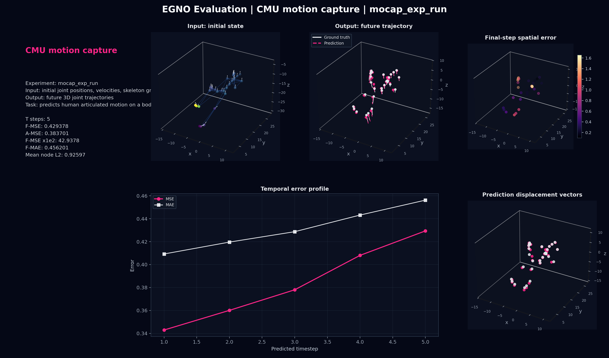
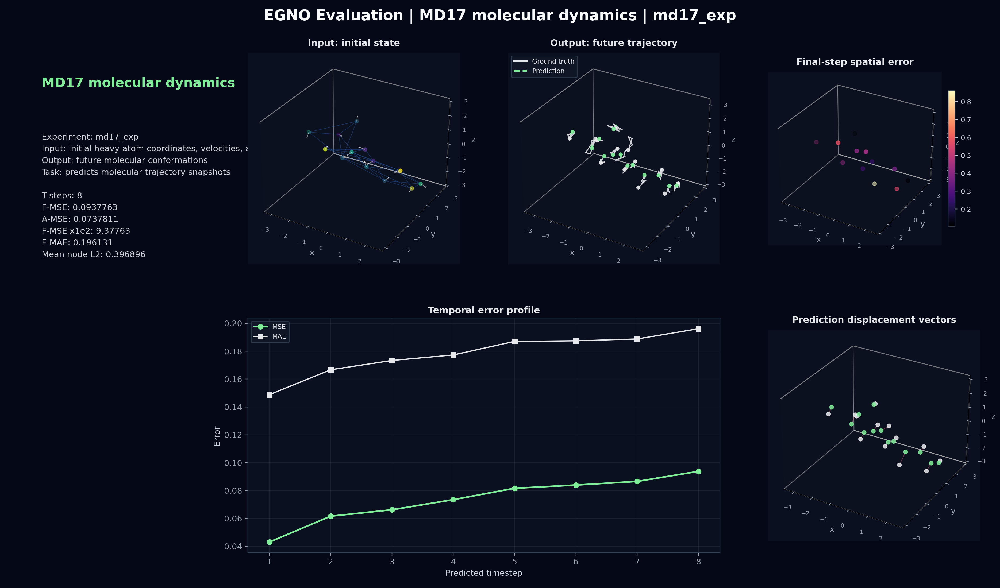
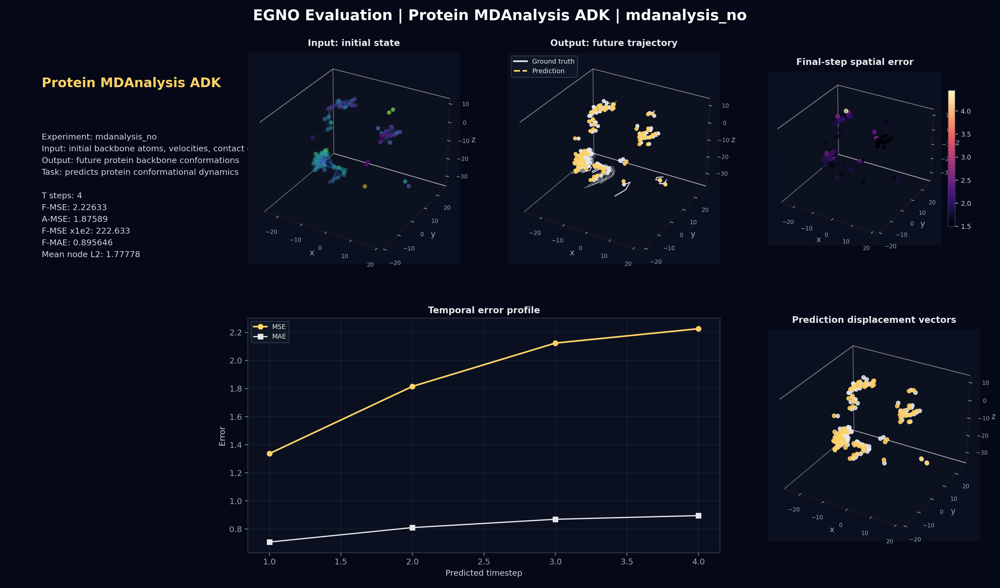

# EGNO 3D 动力学建模复现项目

本项目是对论文 **Equivariant Graph Neural Operator for Modeling 3D Dynamics** 的系统复现与工程整理。复现工作围绕 EGNO 在 3D 几何动力学中的核心思想展开：将粒子系统、人体动作、分子动力学和蛋白质构象演化统一建模为 **图上的 state-to-trajectory 预测问题**，并通过 SE(3)-equivariant 图神经网络与时间神经算子联合学习未来轨迹。

> 原论文：Minkai Xu et al., *Equivariant Graph Neural Operator for Modeling 3D Dynamics*, arXiv:2401.11037



## 项目定位

本仓库不只是运行原始代码，而是围绕可复现性、可解释性和实验展示做了完整整理：

- 系统阅读并梳理 EGNO 论文、数据集构建、模型代码和训练流程。
- 复现 N-body、Motion Capture、MD17、Protein MDAnalysis 四类 3D 动力学 benchmark。
- 优化训练日志与模型保存方式，统一保存 `config.json`、`loss.json`、`summary.json` 和 `saved_model.pth`。
- 编写独立评估和高质量可视化脚本，输出论文指标 `F-MSE` 与 `A-MSE`。
- 补充中文文档，详细解释数据输入输出、模型结构、代码实现和可视化内容。

## 文档导航

| 文档 | 内容 |
|---|---|
| [data.md](data.md) | 四类数据集的来源、文件格式、预处理、输入输出和任务目标 |
| [algorithm.md](algorithm.md) | EGNO 模型结构、EGNN 空间等变模块、时间卷积模块和训练指标 |
| [eval_visualize.md](eval_visualize.md) | 评估和可视化脚本说明 |

## 方法概述

EGNO 将 3D 动力学系统表示为随时间演化的几何图：

```text
输入：G(t0) = {x0, v0, h0, E, e}
输出：{x(t1), x(t2), ..., x(tP)}
```

其中 `x0` 是初始三维坐标，`v0` 是初始速度，`h0` 是节点标量特征，`E/e` 是图结构和边特征。模型一次前向传播输出未来 `P` 个时间点的几何状态。

核心结构包括：

- **EGNN 空间消息传递**：利用相对坐标和标量消息保证旋转、平移等变性。
- **时间神经算子模块**：通过 Fourier temporal convolution 在未来时间维度上建模轨迹相关性。
- **几何时间卷积**：同时处理节点隐特征、坐标和速度，使时间建模不破坏 SE(3) 几何约束。

## 数据集与任务

| 数据集 | 节点 | 输入 | 输出 | 任务 |
|---|---|---|---|---|
| N-body Simulation | 5 个带电粒子 | 初始位置、速度、电荷关系 | 未来粒子位置 | 库仑相互作用动力学预测 |
| Motion Capture | 31 个人体关节 | 初始姿态、速度、骨架图 | 未来人体姿态 | 人体运动轨迹预测 |
| MD17 | 小分子 heavy atoms | 原子坐标、速度、原子类型、分子图 | 未来分子构象 | 小分子动力学预测 |
| Protein MDAnalysis | ADK backbone atoms | backbone 坐标、速度、接触图 | 未来蛋白构象 | 蛋白质构象演化预测 |

各数据集的具体文件、shape 和 `Dataset.__getitem__()` 返回内容见 [data.md](data.md)。

## 复现实验结果

评估指标遵循论文定义：

- `F-MSE`：Final MSE，只计算最后一个预测时间点的位置均方误差。
- `A-MSE`：Average MSE，计算所有预测时间点的位置均方误差平均。
- `F-MSE × 10^2`：与论文表格中 `MSE (×10^-2)` 形式对照。

| 实验 | 测试样本 | `P` | `F-MSE` | `A-MSE` | `F-MSE × 10^2` |
|---|---:|---:|---:|---:|---:|
| N-body | 2000 | 5 | 0.00611 | 0.00253 | 0.611 |
| Mocap Walk | 600 | 5 | 0.06515 | 0.05725 | 6.515 |
| Mocap Run | 240 | 5 | 0.42938 | 0.38370 | 42.938 |
| MD17 Aspirin | 2000 | 8 | 0.09378 | 0.07378 | 9.378 |
| Protein ADK | 835 | 4 | 2.22633 | 1.87589 | 222.633 |

结果来自 `outputs/*/metrics.json`，对应权重保存在 `logs/<exp_name>/saved_model.pth`。

## 可视化展示

复现中新增了统一评估可视化脚本 [egno_eval_visualize.py](egno_eval_visualize.py)，并为每类数据集提供独立入口：

```bash
python eval_visualize_simulation.py
python eval_visualize_mocap.py
python eval_visualize_md17.py
python eval_visualize_mdanalysis.py
```

每张预测图展示：

- 初始输入状态：节点坐标、速度方向、图边。
- 真实未来轨迹与模型预测轨迹。
- 最后一个预测时间点的空间误差热力图。
- 每个预测时间点的 MSE/MAE 曲线。
- 单样本误差指标与预测偏移向量。

### N-body



### Motion Capture





### MD17



### Protein MDAnalysis



## 训练与评估流程

### 环境

原项目建议环境：

```bash
conda env create -f env.yml
conda activate <env_name>
```

Protein MDAnalysis 任务需要额外保证：

```text
MDAnalysis
MDAnalysisData
pytorch3d
```

### 数据准备

N-body：

```bash
cd simulation/dataset
mkdir -p simple
cd simple
python ../generate_dataset.py --num-train 10000 --num-valid 2000 --num-test 2000 --seed 43 --sufix small
```

Motion Capture：

```text
motion/dataset/ 已包含预处理 pkl 和 split 文件
```

MD17：

```text
将 md17_<molecule>.npz 放入 md17/ 目录
```

Protein：

```bash
python mdanalysis/preprocess.py --dir mdanalysis/dataset
```

### 训练

```bash
python main_simulation_simple_no.py --config_by_file --outf logs
python main_mocap_no.py --config_by_file --outf logs
python main_md17_no.py --config_by_file --outf logs
python main_mdanalysis_no.py --config_by_file --outf logs
```

### 评估与可视化

快速检查：

```bash
python eval_visualize_md17.py --max-batches 2 --num-visual-samples 3
```

完整测试：

```bash
python eval_visualize_md17.py --device cuda
```

输出结构：

```text
outputs/<task>/
├── metrics.json
├── dataset_overview.png
├── training_curves.png
├── <exp_name>_prediction.png
└── <exp_name>_samples/
    ├── sample_metrics.json
    └── <exp_name>_sample_000.png
```

## 工程改进

本复现对原始实验代码做了如下整理：

1. **统一 checkpoint 保存**  
   新增 `training_utils.py`，保存模型、优化器、scheduler、配置和 best metrics。

2. **结构化实验日志**  
   每个实验目录包含 `config.json`、`loss.json`、`summary.json`，便于追踪实验。

3. **论文指标复现**  
   在测试集上输出 `F-MSE` 和 `A-MSE`，并支持单样本误差分析。

4. **独立可视化模块**  
   每类数据集均可单独评估和绘图，图中明确展示输入、输出、真实轨迹、预测轨迹和误差。

5. **中文技术文档**  
   补充数据集文档、模型文档和复现说明，使项目更适合作为科研复现与工程作品展示。

## 个人理解与后续方向

EGNO 的关键贡献在于将几何等变 GNN 与神经算子思想结合，使模型能够一次性预测未来轨迹，而不是依赖逐步 rollout。这种方式可以缓解误差累积，并显式学习轨迹内部的时间相关性。

我认为可以继续探索的方向包括：

- 将前向问题扩展到更复杂的物理系统，如流体、弹性体、可变拓扑粒子系统。
- 增加反问题 benchmark，例如从部分轨迹反推初始状态、相互作用参数或分子势能参数。
- 在潜在空间或时间卷积中引入几何先验、守恒约束和局部参考系。
- 优化 attention 或 Fourier temporal convolution 的效率，使其适配更长时间窗口和更大节点规模。
- 引入不确定性建模，处理多解动力学或混沌系统中的预测可信度问题。

## Citation

```bibtex
@article{xu2024equivariant,
  title={Equivariant Graph Neural Operator for Modeling 3D Dynamics},
  author={Xu, Minkai and Han, Jiaqi and Lou, Aaron and Kossaifi, Jean and Ramanathan, Arvind and Azizzadenesheli, Kamyar and Leskovec, Jure and Ermon, S. and Anandkumar, Anima},
  journal={arXiv preprint arXiv:2401.11037},
  year={2024}
}
```

## Acknowledgement

本项目基于 EGNO 官方开源实现进行复现、整理与扩展。原始项目构建在 EGNN、GMN 等优秀工作基础之上。本文档与新增代码仅用于学习、科研复现和个人项目展示。
